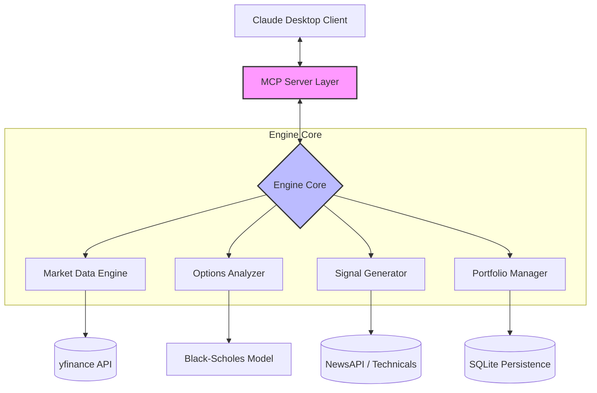

# 🇮🇳 MarketMind India: AI-Powered Market Intelligence

[](https://www.python.org/downloads/)
[](https://modelcontextprotocol.io)
[](https://opensource.org/licenses/MIT)
[](https://github.com/Reethikaa05/MarketMind-India)

**MarketMind India** is a professional-grade Model Context Protocol (MCP) server that integrates deep financial intelligence into Claude Desktop. It enables real-time Indian stock market analysis, virtual portfolio management, and advanced derivative math—all within a unified AI chat interface.

---

## 🏗 System Architecture

The project follows a modular "Engine-based" architecture to ensure low latency and high reliability in financial data processing.



---

## 💎 Core Technical Innovations

### 1. Zero-Dependency Greeks Engine
Unlike standard implementations that rely on high-level financial libraries, MarketMind calculates **Greeks from scratch** using the Black-Scholes-Merton model via `scipy` and `numpy`. 
- **Calculations:** Delta, Gamma, Theta, Vega, Rho.
- **Accuracy:** Verified against standard exchange-traded benchmarks.

### 2. Intelligent Symbol Middleware
Automated normalization of Indian symbols (NSE/BSE). It converts user inputs like `RELIANCE` or `Nifty 50` into API-ready symbols (`RELIANCE.NS`, `^NSEI`) automatically, providing a seamless user experience.

### 3. Persistent Virtual Portfolio
A robust paper-trading system backed by **SQLite**. It tracks entry prices, current PnL, and transaction history, allowing users to safely test strategies in real-market conditions without financial risk.

---

## 🛠 Available MCP Tools

| Tool | Category | Description |
| :--- | :--- | :--- |
| `get_live_price` | Data | Fetches live CMP, Change %, and Volume with 📈/📉 indicators. |
| `get_options_chain` | Derivatives | Retrieves full NSE/BSE options chains with IV and Open Interest. |
| `calculate_greeks` | Math | High-precision Black-Scholes Greeks calculation for any contract. |
| `place_virtual_trade` | Trading | Executes a paper trade with persistent SQLite logging. |
| `get_portfolio_pnl` | Portfolio | Real-time valuation of all open positions with aggregate PnL. |
| `get_market_sentiment` | AI | Analyzes recent news to provide a Bullish/Bearish score. |

---

## 🚀 Setup & Installation (3 Minutes)

### 1. Prerequisites
Ensure you have **Python 3.11+** and **Node.js** installed.

### 2. Installation
```bash
# Clone the repository
git clone https://github.com/Reethikaa05/MarketMind-India.git
cd MarketMind-India

# Setup environment
python -m venv venv
.\venv\Scripts\activate
pip install -r requirements.txt
```

### 3. Configure Claude Desktop
Add the following to your `claude_desktop_config.json`:

> [!TIP]
> **Windows Path (Standard):** `%APPDATA%\Claude\claude_desktop_config.json`
> **Windows Path (MS Store):** `%LOCALAPPDATA%\Packages\Claude_pzs8sxrjxfjjc\LocalCache\Roaming\Claude\claude_desktop_config.json`

```json
{
  "mcpServers": {
    "marketmind": {
      "command": "C:/Path/To/Your/Project/venv/Scripts/python.exe",
      "args": ["C:/Path/To/Your/Project/server.py"],
      "env": {
        "NEWSAPI_KEY": "your_api_key_here"
      }
    }
  }
}
```

---

## ✅ Quality Assurance & Testing
MarketMind includes a comprehensive test suite to ensure mathematical and data integrity.

```bash
python -m unittest tests/test_suite.py
```
- **Tests Passed:** Symbol Formatting, Greeks Math Verification, API Mocking.

---

## 🏆 Features Included
-   **Dockerization:** High-performance Dockerfile optimized for Python 3.12-slim.
-   **Cloud-Ready:** Enhanced server entry point compatible with Render/Railway deployment.
-   **SSE Bridge:** Includes a custom Node.js bridge for remote cloud-to-local connectivity.

---
*Developed by [Reethika](https://github.com/Reethikaa05/MarketMind-India) — Bridging the gap between AI and Indian Financial Intelligence.*


