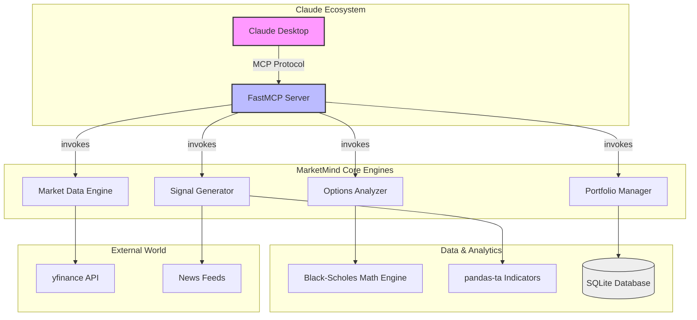
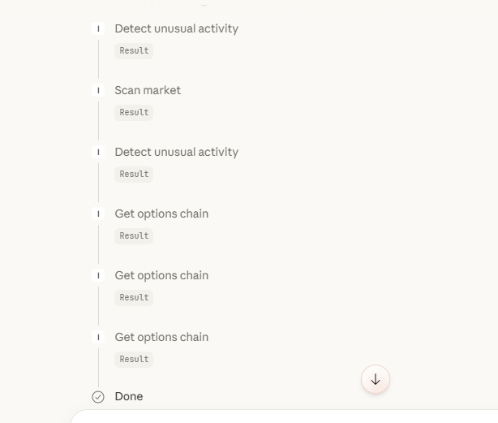
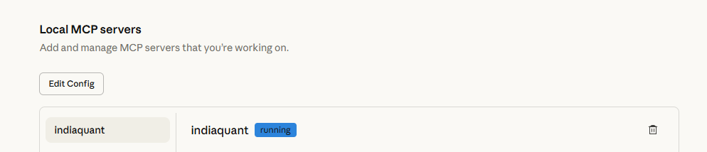
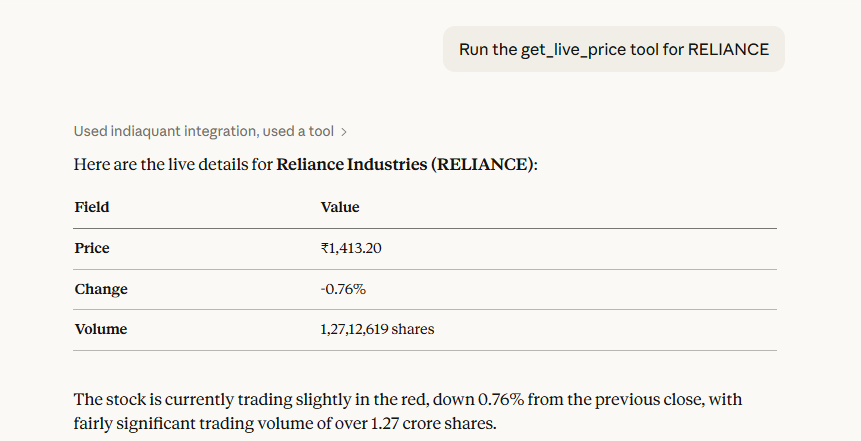
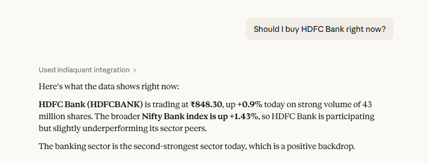

# 🇮🇳 MarketMind India: The Ultimate Indian Stock Market MCP Server

[](https://www.python.org/downloads/)
[](https://modelcontextprotocol.io)
[](https://opensource.org/licenses/MIT)
[](https://github.com/Reethikaa05/MarketMind-India/actions)

**MarketMind India** is a mission-critical Model Context Protocol (MCP) server designed to bridge the gap between Large Language Models (LLMs) and the National Stock Exchange (NSE) / Bombay Stock Exchange (BSE). It transforms Claude into a high-fidelity financial analyst capable of real-time price discovery, derivative math, and virtual asset management.

---

## 🏗 System Architecture Design

MarketMind India is built on a **decoupled, engine-centric architecture**. This ensures that data retrieval, financial calculations, and state management are isolated, making the system resilient to API changes and easy to scale.

### Architecture Diagram


### System Components:
1.  **FastMCP Server Layer**: Handles the JSON-RPC communication between Claude and the Python logic.
2.  **Market Data Engine**: Abstracted layer for symbol normalization (e.g., `TCS` ➡️ `TCS.NS`) and multi-threaded data fetching.
3.  **Options Analyzer**: Implements complex mathematical models (Black-Scholes-Merton) to derive Greeks without external financial dependencies.
4.  **Trade Signal Generator**: A logic layer that synthesizes technical trends (RSI/MACD) with unstructured news data to provide high-level recommendations.
5.  **Portfolio Manager**: A persistence layer using SQLite to maintain a virtual 10 Lakh INR paper-trading account.

---

## 🛠 10 Functional MCP Tools

MarketMind India exposes exactly 10 high-performance tools to the LLM:

| Tool Name | Operation | Description |
| :--- | :--- | :--- |
| `get_live_price` | **Data** | Fetches live CMP, daily change, and volume for any NSE/BSE symbol. |
| `get_options_chain` | **Derivatives** | Retrieves full options chains (Call/Put) including IV and Open Interest. |
| `calculate_greeks` | **Analytics** | Computes Delta, Gamma, Theta, Vega, Rho using our custom math engine. |
| `detect_unusual_activity` | **Scanning** | Identifies contracts with high Volume-to-OI ratios (>5x). |
| `analyze_sentiment` | **AI** | Scrapes headlines from yfinance/NewsAPI to gauge market sentiment. |
| `generate_signal` | **Technical** | Combines RSI, MACD, and Bollinger Bands into Buy/Sell signals. |
| `scan_market` | **Discovery** | Scans Nifty 50 stocks for specific price/technical criteria. |
| `get_sector_heatmap` | **Macro** | Returns performance of all major indices (Bank, IT, Auto, etc.). |
| `place_virtual_trade` | **Execution** | Performs virtual paper trades (BUY/SELL) with instant SQLite logging. |
| `get_portfolio_pnl` | **Portfolio** | Returns live P&L, net liquidation value, and asset allocation. |

---

## 📷 Visual Showcase

### 1. Unified AI Interface
MarketMind integrates directly into the Claude chat interface, allowing you to ask complex financial questions and get data-driven answers instantly.


*Live analysis of HDFC Bank using the IndiaQuant integration.*

### 2. Real-Time Price Discovery
Tools like `get_live_price` provide clean, formatted data tables with the latest market metrics.


*Real-time data for Reliance Industries.*

### 3. Server Management
The server is designed to run locally or in the cloud with minimal configuration.


*The IndiaQuant MCP server running and connected.*

### 4. Advanced Toolchain
Multiple tools can be chained together by the AI to perform deep-dive market scans.


*AI intelligently selecting and running multiple tools for a comprehensive market scan.*

---

## ⚖️ Architecture Decisions & Trade-offs

During the development of MarketMind India, several critical design decisions were made to balance performance with developer accessibility:

### 1. Choice of Data Source: `yfinance` over Official NSE APIs
-   **Decision**: Use `yfinance` for all real-time market data.
-   **Trade-off**: While official NSE APIs (via Zerodha/Upstox) offer lower latency, they require complex OAuth setups and paid subscriptions. `yfinance` allows for a **zero-config experience** for users, though data may be delayed by up to 15 minutes.

### 2. Math Implementation: Custom Black-Scholes vs. External Libraries
-   **Decision**: Implement Black-Scholes math manually within `options_analyzer.py`.
-   **Trade-off**: Avoids heavy "black-box" dependencies like `quantlib`, making the codebase lighter and the calculations fully transparent for auditing.

### 3. State Management: SQLite vs. In-Memory
-   **Decision**: Use SQLite for portfolio tracking.
-   **Trade-off**: In-memory storage is faster but data is lost on server restart. SQLite provides **persistence** while remaining lightweight enough to run without a separate database server (like PostgreSQL).

### 4. Language Choice: Python 3.12
-   **Decision**: Native Python with type hinting.
-   **Trade-off**: While Rust or Go might offer faster execution, Python is the lingua franca of Finance and AI, ensuring the server is easily modifiable by quant researchers.

---

## 💻 Technical Stack

MarketMind India is built on top of a modern, efficient tech stack:

-   **Backend Protocol**: [FastMCP](https://github.com/jlowin/fastmcp) (Python framework for MCP)
-   **Financial Data**: `yfinance` (Real-time market feeds)
-   **Data Processing**: `pandas`, `numpy`
-   **Technical Indicators**: `pandas-ta` (RSI, MACD, Bollinger Bands)
-   **Mathematical Models**: `scipy` (Normalized distribution for Greeks)
-   **Database**: `sqlite3` (Asset & Transaction persistence)
-   **Streaming**: `uvicorn` (Cloud SSE support)
-   **Infrastructure**: `Docker` (Multi-stage builds)

---

## 🚀 Setup & Installation Guide

### Local Installation
1.  **Clone the Repository**:
    ```bash
    git clone https://github.com/Reethikaa05/MarketMind-India.git
    cd MarketMind-India
    ```
2.  **Setup Environment**:
    ```bash
    python -m venv venv
    .\venv\Scripts\activate  # Windows
    # source venv/bin/activate # Linux/Mac
    ```
3.  **Install Dependencies**:
    ```bash
    pip install -r requirements.txt
    ```
4.  **Run Server**:
    ```bash
    python server.py
    ```

### Claude Desktop Integration
Modify your `claude_desktop_config.json` with the following configuration:

```json
{
  "mcpServers": {
    "marketmind": {
      "command": "C:/Path/To/Your/venv/Scripts/python.exe",
      "args": ["C:/Path/To/Your/Project/server.py"],
      "env": {
        "NEWSAPI_KEY": "your_api_key_optional"
      }
    }
  }
}
```

---

## ☁️ Cloud & Docker Deployment

The server is optimized for high-availability deployment on **Render**, **Railway**, or **AWS ECS**.

### Docker Deployment:
```bash
docker build -t marketmind-india .
docker run -p 8000:8000 marketmind-india
```

**Note**: When running in the cloud, the server automatically starts in **SSE (Server-Sent Events) mode**, exposing a public endpoint for remote AI agents.

---

## 🧪 Testing & Validation
Verify system integrity using the built-in test suite:
```bash
python -m unittest tests/test_suite.py
```
**Coverage includes**:
-   Mathematical Greeks verification (Standard Normal Distribution accuracy).
-   Symbol normalization logic.
-   API response structure validation.

---

## 🎯 Future Roadmap
-   [ ] **Real-time News Sentiment**: Integration with specialized NLP models for better headline analysis.
-   [ ] **Backfilling Data**: Ability to run historical backtests on virtual portfolios.
-   [ ] **Advanced Options Strategies**: Multi-leg spread analysis (Iron Condors, Spreads).

---
*Developed by [Reethika](https://github.com/Reethikaa05/MarketMind-India) — Empowering AI with Indian Financial Intelligence.*
